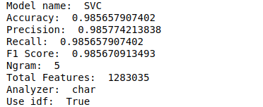

## Language Detector

Language detection is a natural language processing task of identifying the language a given
document is written in. It is often the first step in a document processing pipeline. Moreover,
it is considered to be a critical preprocessing step in applications that require language specific
modeling, such as search engines, where depending on the detected language different
tokenizers may be used. Another common example of applying language detection is as a
preceding step to machine translation, since the language of the text to be translated is not
always specified. Therefore, a reliable language detection tool is needed.[1]

#### Survey

1. Ivana Balazevic et. al. used character n-grams and bag-of-words features to train different classifiers like SVM, Logistic Regression etc. They used 22,000 tweets in 16 different languages to train their classifiers. They reported 96.92 % F1_score for SVM and 96.72% for Logistic regression. [1]
2. Archana Garg et. al. have a whole survey about different language identification techniques [2]

#### Dataset

[European Parliament Proceedings Parallel Corpus](http://www.statmt.org/europarl/) is a text dataset used for evaluating language detection engines. The 1.5GB corpus includes 21 languages spoken in EU.  

#### Methodology

Both word and character n-grams and bag-of-words features based on tf-idf was used for feature extraction.  Logistic regression and SVM were used as classifier.  Details can be found in Language_Detection.ipynb. Only 100 files from each class were used. 

#### Result

30 models were trained and tested. Analysis of the results can be found in result_analysis.ipynb .The best accuracy was found for given model:

#### Reference

1. [Language Detection For Short Text Messages In Social Media](https://arxiv.org/pdf/1608.08515.pdf)

2. [A survey of Language Identification Techniques and Applications](http://citeseerx.ist.psu.edu/viewdoc/download?doi=10.1.1.689.5252&rep=rep1&type=pdf)

